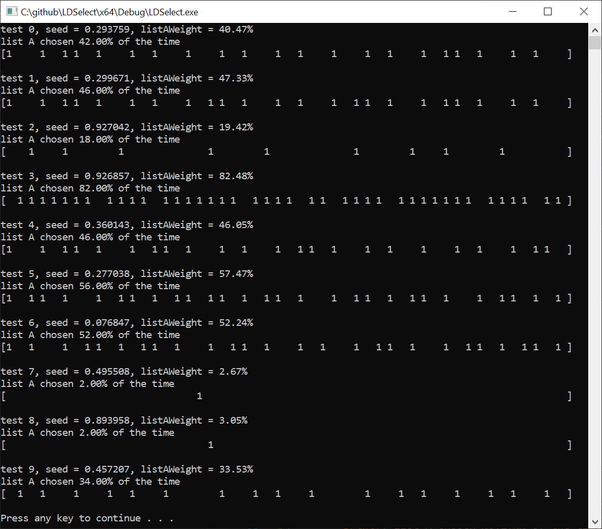

# LDSelect
Using a low discrepancy sequence to merge two lists with a probability that is honored both globally and locally.

Notice how the 1s are fairly evenly distributed no matter what the probability is.  This uses the golden ratio additive recurrence LDS for maximum speed while having decent quality, and sets the first sample to a random number to add randomization to the selection process.

